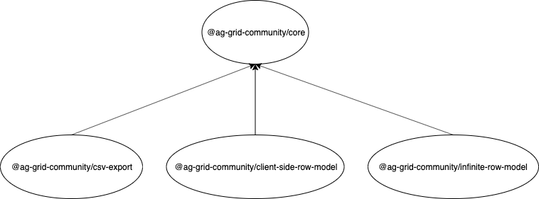
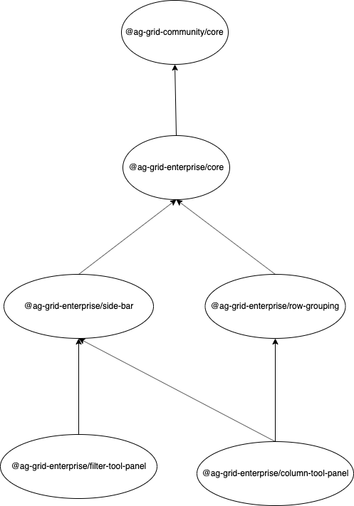

ag-Grid `modules` allow you to pick and choose which features you require, resulting in a smaller application size overall, with the trade-off being that you need to register the modules you require.

## Introduction

### @ag-grid-community/all-modules

`@ag-grid-community/all-modules` can be considered to be equivalent to `ag-grid-community`, but with the additional need to register modules within. If using this module you might be better off using `ag-grid-community` as the bundle size will be similar and will reduce the need to register modules.


### @ag-grid-enterprise/all-modules

`@ag-grid-enterprise/all-modules` can be considered to be equivalent to `ag-grid-enterprise`, but with the additional need to register modules within. If using this module you might be better off using `ag-grid-enterprise` (along with `ag-grid-enterprise)` as the bundle size will be similar and will reduce the need to register modules.


<br/><br/>

[[note]]
| If you decide to use `@ag-grid-enterprise/all-modules` then you do **not** need to
| specify `@ag-grid-community/all-modules` too. `@ag-grid-enterprise/all-modules` 
| will contain all Community modules.

### @ag-grid-community/core

This module contains the core code required by the Grid and all modules (Enterprise or Community) depend on it. As such `@ag-grid-community/core` will always be available no matter what module you specify in your `package.json`.




<br/><br/>

For example, let's assume you specify the following in your `package.json`:

```js
"dependencies": {
    "@ag-grid-community/client-side-row-model": "22.0.0"
}
```

You can then use `@ag-grid-community/core` as this will be implicitly available to you:

```jsx
import { Grid, GridOptions } from '@ag-grid-community/core';
import { ClientSideRowModelModule } from "@ag-grid-community/client-side-row-model";

// ... the rest of your code
```

### @ag-grid-enterprise/core

All Enterprise modules depend on `@ag-grid-enterprise/core` as such will always be available no matter what Enterprise module you specify in your `package.json`.

The main functionality you'll want to import from the `@ag-grid-enterprise/core` is the `LicenceManager`.




_The above is a truncated hierarchy of Entreprise modules for illustrative purposes._

For example, let's assume you specify the following in your `package.json`:

```js
"dependencies": {
    "@ag-grid-enterprise/filter-tool-panel": "22.0.0"
}
```

You can then use `@ag-grid-enterprise/core` as this will be implicitly available to you:

```js
import { Grid, GridOptions } from '@ag-grid-community/core';
import { LicenseManager } from '@ag-grid-enterprise/core';
import { FiltersToolPanelModule } from "@ag-grid-enterprise/filter-tool-panel";

LicenseManager.setLicenseKey(...your key...);

// ... the rest of your code
```

